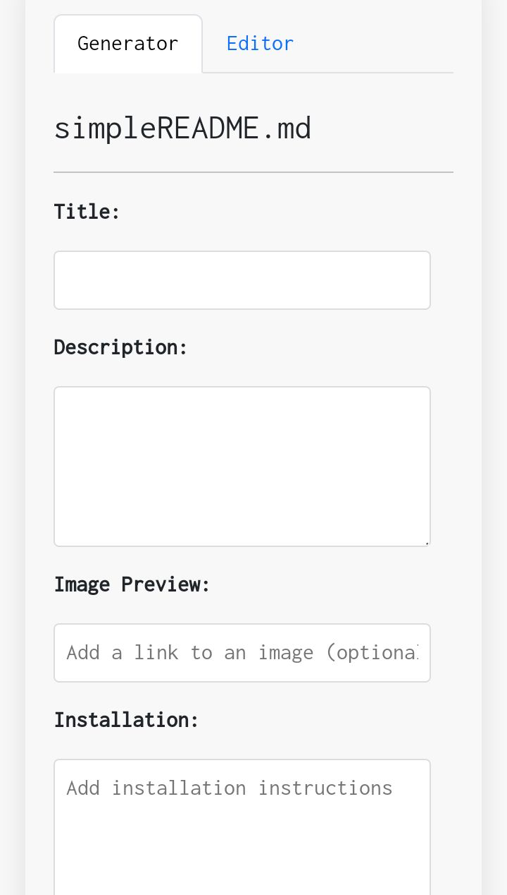
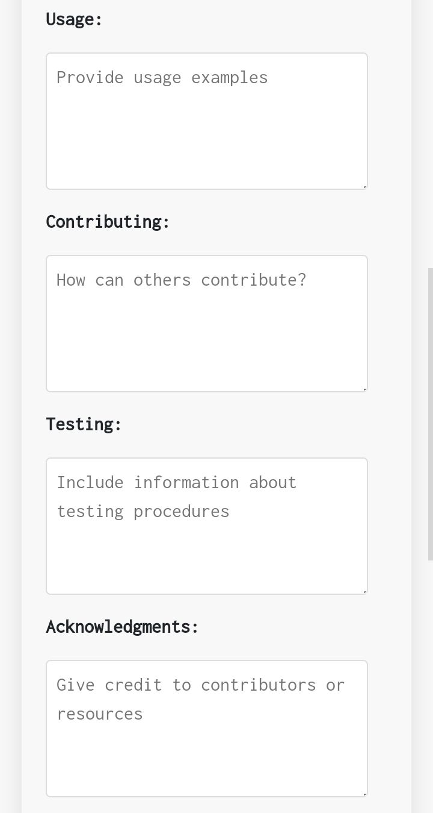
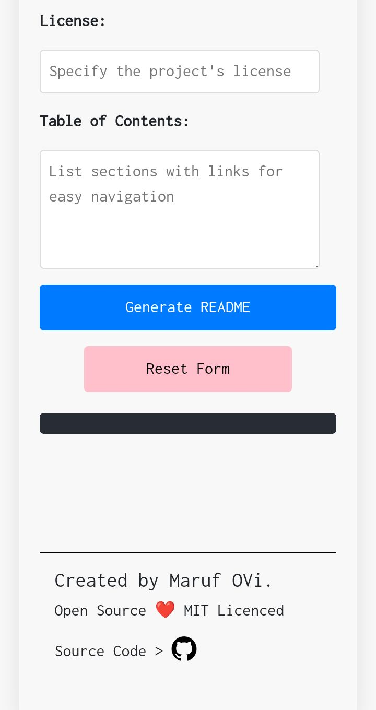
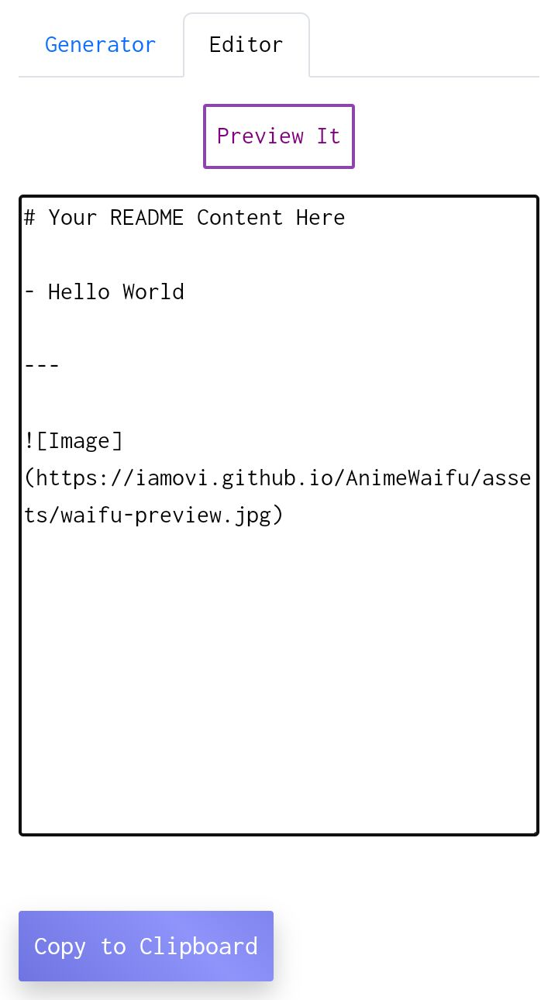
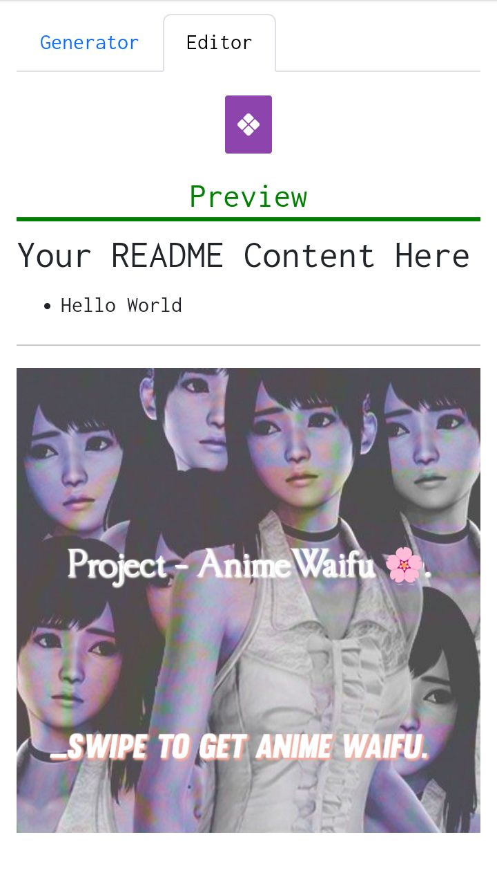

## Website/

Visit to use_ [https://iamovi.github.io/yourREADME/](https://iamovi.github.io/yourREADME/)

### Preview Pics

---

### What you will get here
- Fill-up input box step by step and click 'Generate README' and you will get a well customized README.md

- You can copy generated README texts,

- or you can download as a README.md file by clicking download button.

- Also it has README editor feature that you can use to write your README texts and,

- View Preview of it.